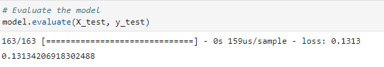
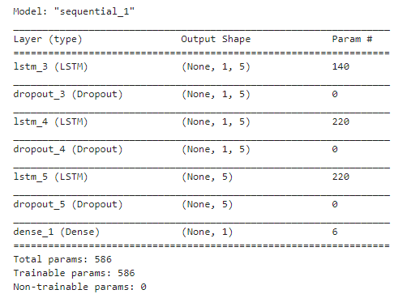
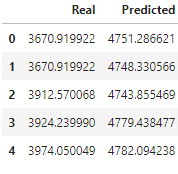
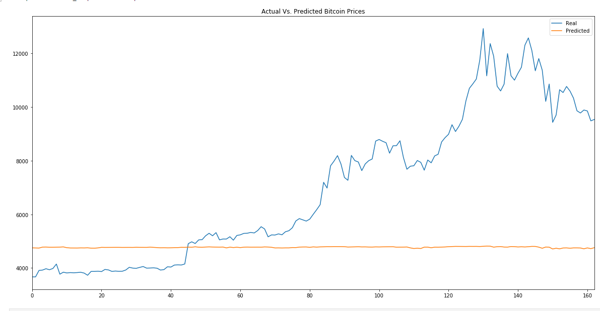
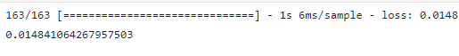
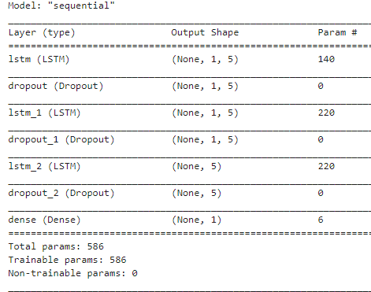
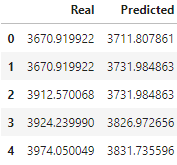
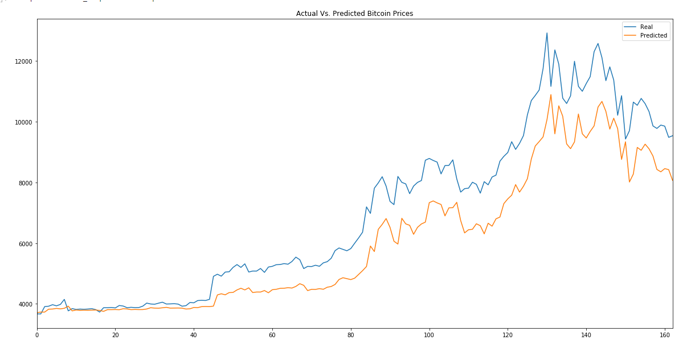

# Neurotic Fear and Greed Index to Predict Closing Prices
This activity reviews a Recurrent Neural Network (RNN) model's ability to predict Bitcoin closing prices using Fear and Greed Index historic data. More specifically, this activity focuses on Long-Short Term Memory (LSTM) model, a type of RNN with a mathematical backbone perfect for recognizing patterns in sequence of numerical data, to compare its predictive ability when trained with FNG historical data versus when it's trained with closing price historical data. Then its performance is reviewed to illustrate which data is more valuable when predicting future results.

### Fear and Greed Index LSTM Model

 

 

 

### Closing Prices LSTM Model

 

 

 

### Conclusion
**Which model has a lower loss?** 
The model training with closing prices has a lower loss number of 0.015, while the one training with FNG index has a loss function of 0.13

**Which model tracks the actual values better over time?** 
The model using the closing prices tracks the actual values better than the FNG model. The FNG model does not come near to predicting the actual values correctly.

**Which window size works best for the model?** 
The window size that works best for the models is 1. The lower the window the better the performance. However, their unit number features affect their performance differently. the FNG performs better with a unit numbers of 30, while the closing price model performs better with a unit number of 5.
